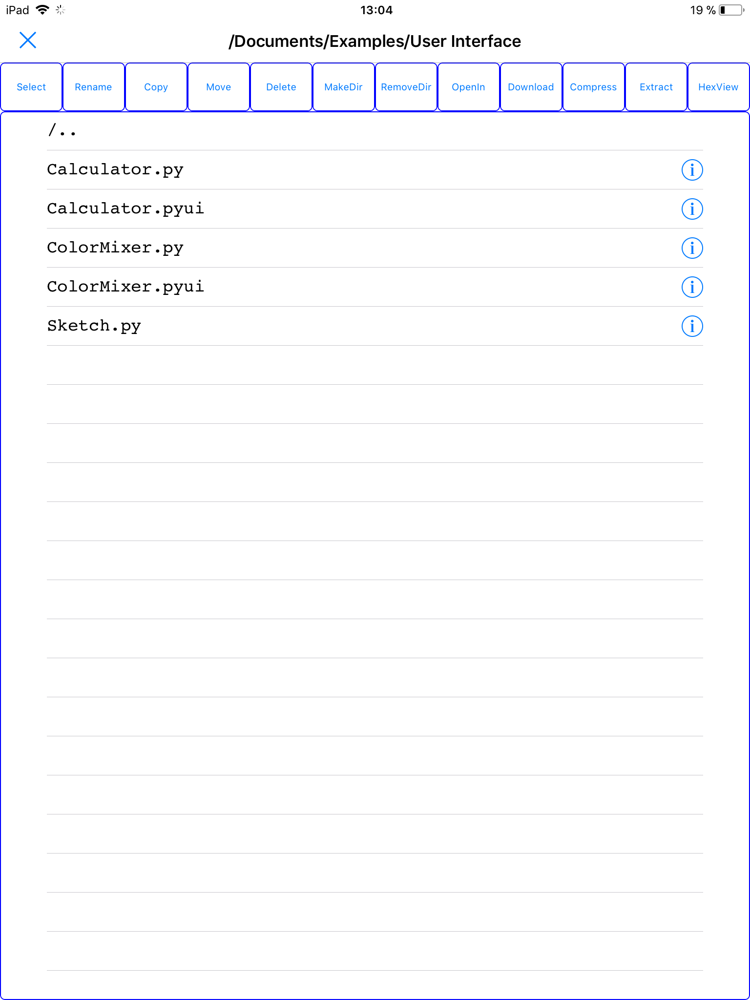

PhoneManager
============

Scroll buttons to the left for all commands. 
 
RemoveDir deletes everthing in the current dir (files and subdirs)  
Extract always creates a subdir with the archivename 
GetPic multiselect 
PicView now browses all heic, jpeg, jpg, png, gif, bmp, and tif files 
Move and Rename are changing the directory path/name when no file is selected!!! 
Multiselect for move, copy, delete and compress. 
Select button => Fast select of all, none, py* or other filetypes  
Use at your own risk :) 
 
Tested with Pythonista 3.2 for iOS (Python 3.6) 
 

